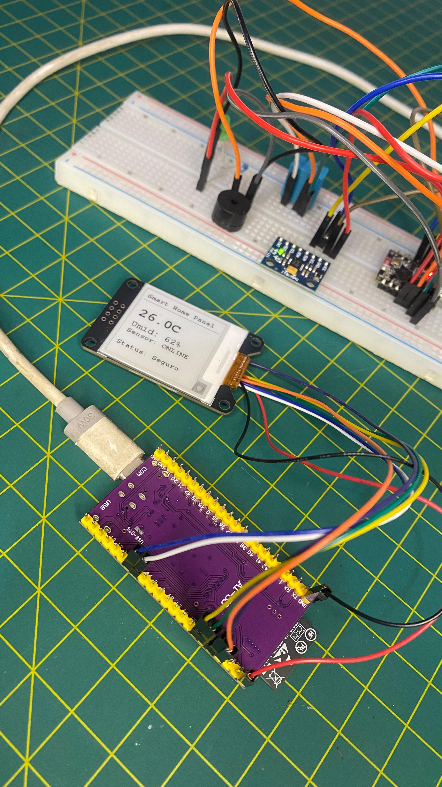

# 🏡 Smart Home Panel & Security System


Um sistema de monitoramento residencial IoT focado em **baixa latência** e **alta resiliência**. O projeto consiste em uma arquitetura de nós distribuídos, operando de forma autônoma e independente da infraestrutura de rede local (roteadores/internet), garantindo que alertas críticos de segurança sejam processados em tempo real.




## 📐 Arquitetura do Sistema

O sistema foi desenhado separando a responsabilidade de sensoriamento da interface visual, comunicando-se através da camada MAC usando o protocolo **ESP-NOW**. Isso garante uma transmissão instantânea (latência < 5ms) e elimina pontos únicos de falha (Single Point of Failure) ligados a roteadores Wi-Fi tradicionais.

* **Sensor Node (ESP32-C3):** O "operário" da ponta. Escrito em C puro (ESP-IDF) para máximo desempenho. Responsável por monitorar as variáveis ambientais e de movimento, priorizando o envio imediato de interrupções críticas.
* **Display Node (ESP32-S3):** O "cérebro" visual. Utiliza o framework Arduino para gerenciar complexidades de driver de vídeo. Recebe os dados assíncronos e orquestra a renderização em um display E-paper, aplicando lógica de tolerância a falhas (Heartbeat).

## 🚀 Destaques de Engenharia

Ao invés de um simples loop de leitura e escrita, este projeto implementa lógicas de sistemas embarcados profissionais:

* **Event-Driven Transmission:** O acelerômetro (MPU6050) não espera o ciclo de leitura da temperatura (DHT11). Se um movimento for detectado, o status de segurança é atualizado e transmitido instantaneamente, ignorando o delay de sensores mais lentos.
* **E-paper Partial Refresh:** Para evitar o congelamento de processamento e o incômodo visual do *Full Refresh* a cada segundo, a tela de tinta eletrônica (1.54" GxEPD2) atualiza apenas as zonas necessárias em milissegundos.
* **Fail-Safe & Timeout Logic (Watchdog Visual):** A tela não confia cegamente que o sensor está funcionando. Ela calcula o delta de tempo (`millis()`) entre os pacotes recebidos. Se o Sensor Node ficar mudo por mais de 5 segundos, a tela alerta ativamente que o sensor está `OFFLINE`.
* **Feedback de Restauração:** O sistema emite sinais sonoros diferenciados não apenas para o alarme de movimento, mas um tom de confirmação quando os eixos inerciais se estabilizam, indicando retorno ao "Status: Seguro".

## 🧰 Hardware Utilizado

**Nó de Sensoriamento (Transmissor):**
* Placa: ESP32-C3
* Acelerômetro/Giroscópio: MPU6050 (Detecção de intrusão/movimento)
* Sensor Ambiental: DHT11 (Temperatura e Umidade)
* Atuador: Buzzer Ativo (Sinalização Acústica)

**Nó de Interface (Receptor):**
* Placa: ESP32-S3-WROOM-1
* Display: E-paper 1.54" SPI (GxEPD2_154_D67)

## 💻 Tech Stack & Ferramentas

* **C / ESP-IDF:** Utilizado no Node C3 para controle direto do hardware, threads (FreeRTOS) e baixo consumo.
* **C++ / Arduino Framework:** Utilizado no Node S3 para renderização gráfica e manipulação ágil de strings.
* **PlatformIO:** Gerenciamento unificado de dependências, builds e ambientes para múltiplas arquiteturas físicas no mesmo repositório.

## ⚙️ Como Executar

O repositório está dividido em duas raízes independentes no PlatformIO.

1.  Clone o repositório:
    ```bash
    git clone [https://github.com/paulochiaradia/smart-home-panel.git](https://github.com/paulochiaradia/smart-home-panel.git)
    ```
2.  Abra a pasta do projeto no VS Code com a extensão PlatformIO instalada.
3.  Para compilar o **Sensor Node**, navegue até `firmware/c3-sensor-node` e clique em *Build/Upload*.
4.  Para compilar o **Display Node**, navegue até `firmware/s3-display-node` e clique em *Build/Upload*.
*(O Display Node já está configurado para o modo "Promíscuo/Broadcast" do ESP-NOW, escutando automaticamente o MAC Address do Sensor Node na mesma área de RF).*

---
**Autor:** Paulo Chiaradia
[LinkedIn](https://linkedin.com/in/paulochiaradia) | Analista de Dados Pleno & Entusiasta IoT
